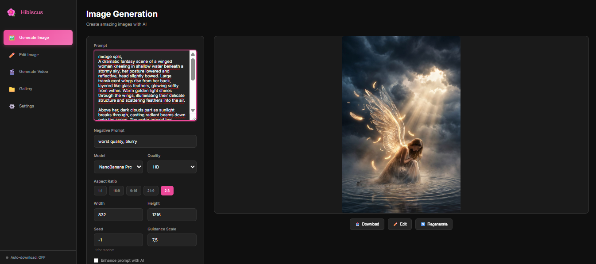
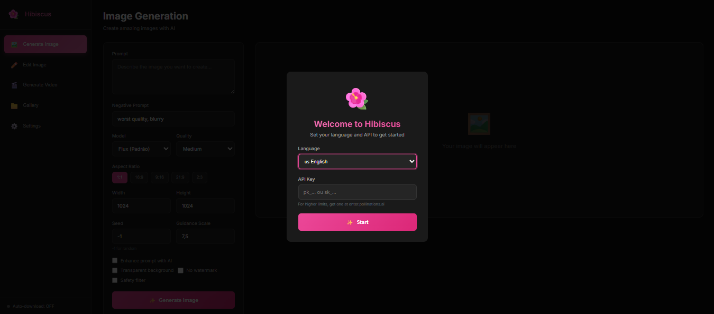
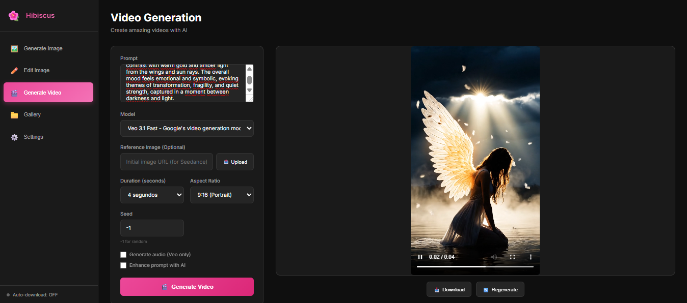

<h1 align="center">🌺 Hibiscus</h1>

<p align="center">
  <strong>AI-powered creative studio for image and video generation</strong>
</p>

<p align="center">
  
  <a href="https://hibiscus-yp9g.onrender.com/">
    
  </a>
</p>

<p align="center">
  <a href="https://pollinations.ai/">
    
  </a>
  
  
</p>

<p align="center">
  
</p>

<p align="center">
  
</p>

<p align="center">
  
</p>

---

## ✨ Features

| Feature | Description |
|---------|-------------|
| 🎨 **Image Generation** | Create stunning images with Flux, Turbo, GPT-Image, and more |
| ✏️ **Image Editing** | Transform existing images with AI-powered img2img |
| 🎬 **Video Generation** | Generate videos with Veo, Seedance models |
| 📁 **Smart Gallery** | Automatic organization by date with model badges |
| 💾 **Auto-Download** | Save creations automatically to organized folders |
| 📂 **Custom Media Dir** | Choose where to save your creations |
| 🔄 **Smart Retry** | Exponential backoff + safety filter persistence |
| 🌍 **Multi-Language** | Portuguese, English, and Spanish |
| 🎭 **Themes** | Dark and Light mode support |
| 📦 **Modular Code** | Clean architecture with separated modules |

---

## 🚀 Quick Start

1. **Install Dependencies:**
   ```bash
   npm install
   ```

2. **Start the App:**

   **Windows:**
   ```cmd
   run.bat
   ```

   **Linux / macOS:**
   ```bash
   ./run.sh
   ```

The app will open at `http://localhost:3333`

---

## 🎮 How to Use

1. **Choose Language** - Select PT/EN/ES on first run
2. **Generate Image** - Enter prompt → Select model & settings → Generate
3. **Edit Image** - Upload image(s) → Describe changes → Apply
4. **Generate Video** - Enter prompt → Choose duration → Generate
5. **Gallery** - View, download, edit, or delete creations
6. **Settings** - Configure API key, auto-download, theme

---

## 🔑 API Key

For higher rate limits and premium models, get your API key at:

<p align="center">
  <a href="https://enter.pollinations.ai">
    
  </a>
</p>

---

## 📁 Project Structure

```
Hibiscus/
├── app/
│   ├── index.html      # Main UI
│   ├── styles.css      # Styling (Imports) 
│   ├── app.js          # Frontend logic
│   ├── server.js       # Backend server
│   ├── css/            # Modular CSS
│   │   ├── core/       # Variables, reset, animations
│   │   ├── layout/     # Layout scaffolding
│   │   ├── components/ # UI components
│   │   └── modules/    # Feature-specific styles
│   ├── modules/        # JavaScript Modules
│   │   ├── core/       # Core utilities
│   │   ├── gallery/    # Gallery logic
│   │   ├── generators/ # Image/Video generation logic
│   │   ├── ui/         # UI management
│   │   ├── i18n.js     # Internationalization
│   │   ├── logger.js   # Logging system
│   │   ├── state.js    # State management
│   │   └── backend.js  # Backend API client
│   └── gallery/        # Saved Media Storage
│       ├── images/     # By date (DD-MM-YYYY)
│       └── videos/     # By date (DD-MM-YYYY)
├── run.bat / run.sh    # Quick start scripts
└── package.json        # Dependencies
```

---

## 🛠️ Requirements

- **Node.js** v16 or higher
- **Internet connection** for API access

---

## 🔗 Links

<p align="center">
  <a href="https://pollinations.ai/">
    
  </a>
  <a href="https://gen.pollinations.ai/">
    
  </a>
  <a href="https://github.com/pollinations/pollinations">
    
  </a>
</p>

---

## 📋 Changelog

### v1.2.0 (January 2026)
- 🔢 **Resolution Multiplier** - 1x, 2x, 4x toggle for high-res output on image & img2img
- 📐 **Extended Aspect Ratios** - 10 presets: 1:1, 2:3, 3:2, 3:4, 4:3, 4:5, 5:4, 9:16, 16:9, 21:9
- 🛡️ **Improved Safety Retry** - More robust error handling, fewer false cancellations
- 🎨 **UI Consistency** - Unified button styling across the app

### v1.1.0 (January 2026)
- ✨ **Modular Architecture** - Code split into reusable modules (i18n, logger, state, backend)
- 🎲 **Random Seed Fix** - Each generation now produces unique results
- 🏷️ **Model Badges** - Gallery shows which model was used for each creation
- 📂 **Custom Media Directory** - Choose where to save your files

### v1.0.0
- 🎨 Initial release with image/video generation
- 🌍 Multi-language support (PT/EN/ES)
- 📁 Smart gallery with date organization
- 💾 Auto-download feature

---

## 📝 License

MIT License - Feel free to use, modify, and distribute.

---

<p align="center">
  Made with 🤍 by <a href="https://github.com/Hirothewolf">Hirothewolf</a>
  <br/>
  Powered by <a href="https://pollinations.ai/">🐝 Pollinations.ai</a>
</p>
